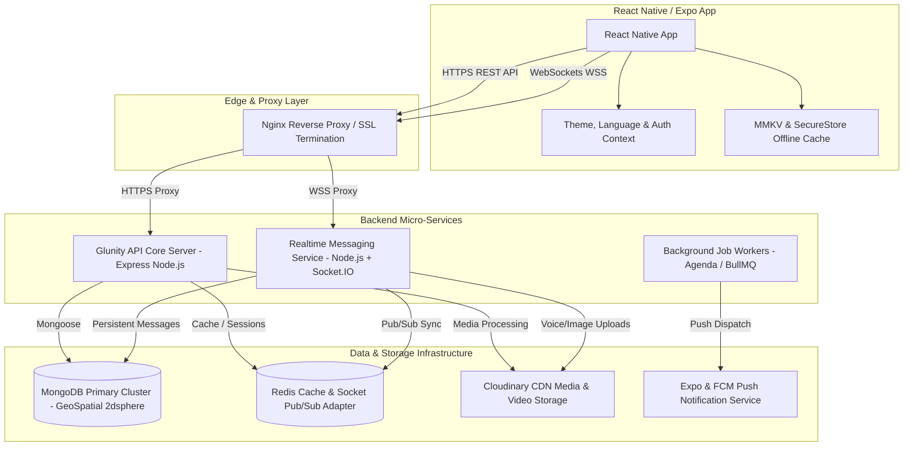
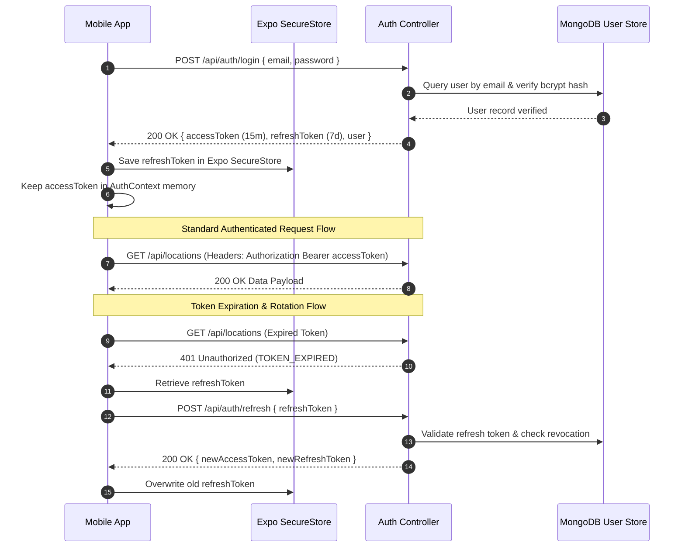
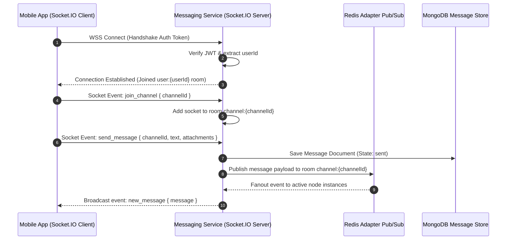
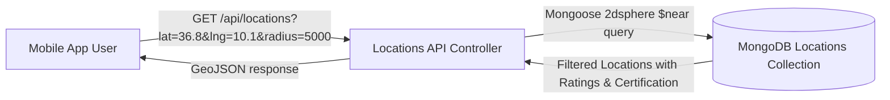
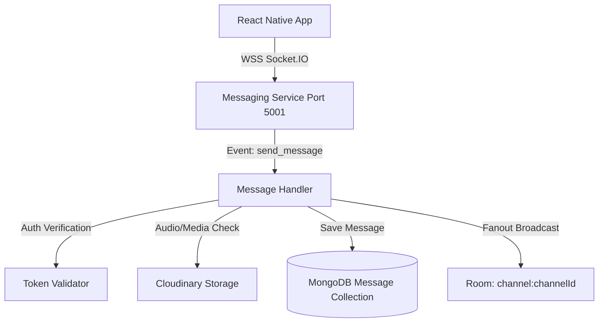

# Glunity Mobile — Technical Architecture & Module Specification

> **Version:** 2.0.0 Pro  
> **Platform:** React Native (Expo SDK 52) & Node.js Micro-monolith (Express + Socket.IO + MongoDB)  
> **Target Audience:** Engineering Team, System Architects, DevOps, Product Owners

---

## 1. Executive Architecture Overview

Glunity is a multi-platform, community-driven ecosystem designed for individuals with celiac disease, gluten intolerance, food choices, and certified gluten-free establishments in Tunisia and internationally.

The platform employs a **De-coupled Micro-Monolith Architecture** consisting of a primary REST & Socket API backend (`api/`), a high-concurrency Real-Time Messaging Service (`messaging-service/`), and a cross-platform React Native mobile client (`mobile/`).

### 1.1 High-Level System Architecture

---

## 2. Core Technical Architecture & Security Protocols

### 2.1 Dual-Token JWT Authentication & Security Chain

Glunity enforces a strict stateless authentication model utilizing short-lived Access Tokens paired with encrypted Refresh Tokens.

#### Security Safeguards Matrix
* **Password Hashing:** `bcryptjs` with 12 salt rounds.
* **Storage Rules:** Access tokens are strictly stored in-memory within `AuthContext`. Refresh tokens are persisted exclusively via `Expo SecureStore` (Hardware-encrypted KeyStore / Keychain).
* **Sanitization & Injection Prevention:** `express-mongo-sanitize` strips `$ operator` injections; `helmet` configures HSTS, CSP, and security headers.
* **Rate Limiting:** `/api/auth/*` routes are capped at 5 requests/15 minutes; global API endpoints are capped at 100 requests/15 minutes per IP.

---

### 2.2 Real-Time Communication Architecture (Socket.IO)

Real-time interaction (chat channels, direct messaging, typing indicators, live location broadcasts, read receipts) is handled via WebSocket connection with handshakes authenticated via JWT.

---

## 3. Comprehensive Functional Modules & Endpoints Catalog

---

### 3.1 Auth & Onboarding Module (`auth`)

#### Purpose & Business Domain
Manages identity lifecycle, profile onboarding (Celiac, Proche, Pro Commerce, Pro Health), email verification, multi-factor authentication, and OAuth login flows.

#### User Roles & Access
* **Public:** Register, Login, Refresh, Password Reset, OAuth, Verify Email.
* **Authenticated User:** Logout, Verify 2FA, Resend Verification.

#### Key Use Cases

##### Use Case 1.1: User Registration & Profile Onboarding
* **Actor:** Unauthenticated Visitor.
* **Pre-conditions:** User has installed the app and opened the registration screen.
* **Trigger:** User fills in registration form and selects a `profileType` (`celiac`, `proche`, `pro_commerce`, `pro_health`).
* **Main Flow:**
  1. User submits name, email, password, profile type, and optional medical details.
  2. Mobile client validates fields client-side.
  3. API receives request, validates schema via `joi`, hashes password with bcrypt.
  4. User record is created in MongoDB.
  5. JWT access and refresh token pair returned along with user object.
  6. Refresh token stored in SecureStore; access token loaded into `AuthContext`.
* **Alternative Flow:** Email already exists -> returns `409 Conflict` with localized error.

#### Technical Implementation
* **Frontend:** `mobile/src/modules/auth/ui/RegisterScreen.tsx`, `AuthContext.tsx`.
* **Backend:** `api/src/app/modules/auth/auth.controller.js`, `auth.service.js`, `auth.routes.js`.
* **Database Model:** `User` schema (`profileType`, `passwordHash`, `isEmailVerified`, `refreshTokenVersion`).

#### REST API Endpoints
| Method | Endpoint | Auth | Description | Payload | Response |
| :--- | :--- | :--- | :--- | :--- | :--- |
| `POST` | `/api/auth/register` | Public | Register user profile | `{ fullName, email, password, profileType }` | `{ success: true, token, user }` |
| `POST` | `/api/auth/login` | Public | Authenticate user | `{ email, password }` | `{ success: true, accessToken, refreshToken, user }` |
| `POST` | `/api/auth/refresh` | Public | Renew access token | `{ refreshToken }` | `{ success: true, accessToken, refreshToken }` |
| `POST` | `/api/auth/logout` | Private | Revoke active session | `{}` | `{ success: true, message }` |
| `POST` | `/api/auth/oauth` | Public | Third-party OAuth login | `{ provider, idToken }` | `{ success: true, accessToken, user }` |
| `GET` | `/api/auth/verify-email/:token` | Public | Verify email address | Token URL Param | `{ success: true, message }` |

---

### 3.2 Collaborative Map & Geospatial Module (`locations`)

#### Purpose & Business Domain
Interactive map enabling celiac users to discover, search, and verify gluten-free safe establishments (restaurants, bakeries, dedicated shops, pharmacies) across Tunisia with certified safety badges.

#### User Roles & Access
* **Public/User:** Search locations, filter by category/distance, view detail & reviews.
* **Authenticated User:** Add new map pin, submit location review, upload photos.
* **Pro Commerce:** Claim establishment listing, update store hours & menu.
* **Admin:** Verify location safety and award certified badge (`isVerified: true`).

#### Key Use Cases

##### Use Case 2.1: Geo-Proximity Establishment Search
* **Actor:** Authenticated Celiac Consumer.
* **Pre-conditions:** Device location permissions granted.
* **Main Flow:**
  1. Mobile app retrieves latitude & longitude via `expo-location`.
  2. Sends `GET /api/locations?lat=X&lng=Y&radius=5000&type=bakery`.
  3. API executes `$near` query on `coordinates` (GeoJSON 2dsphere index).
  4. Returns list of establishments with distance calculation and certification badges.
  5. App renders interactive pins on React Native Maps with custom markers.

#### REST API Endpoints
| Method | Endpoint | Auth | Description | Payload / Params | Response |
| :--- | :--- | :--- | :--- | :--- | :--- |
| `GET` | `/api/locations` | Public | Geo-proximity query | `?lat=&lng=&radius=&type=&verified=` | `{ success: true, data: [Location] }` |
| `GET` | `/api/locations/:id` | Public | Fetch detail & reviews | `:id` param | `{ success: true, data: Location }` |
| `POST` | `/api/locations` | Private | Submit new safe pin | `{ name, type, coordinates, address, phone }` | `{ success: true, data: Location }` |
| `POST` | `/api/locations/:id/click` | Public | Record map click count | `:id` param | `{ success: true, views, clicks }` |

---

### 3.3 Product Catalog & OCR Allergen Module (`products`)

#### Purpose & Business Domain
Community database of verified gluten-free consumer products with ingredient list analysis, barcode scanning, seller inventory attachment, and OCR scan verification.

#### Key Use Cases

##### Use Case 3.1: Product Verification & Ingredient Inspection
* **Actor:** Celiac Consumer.
* **Main Flow:**
  1. User scans barcode or searches product name.
  2. App displays product detail: gluten status (`certifiedGF`, `naturallyGF`, `containsGluten`), verified ingredient breakdown, cross-contamination warnings.
  3. Pro-commerce users can link products to their establishment inventory.

#### REST API Endpoints
| Method | Endpoint | Auth | Description | Payload | Response |
| :--- | :--- | :--- | :--- | :--- | :--- |
| `GET` | `/api/products` | Public | List products (paginated) | `?category=&certified=&search=&page=` | `{ success: true, data: [Product] }` |
| `GET` | `/api/products/:id` | Public | Product details | `:id` param | `{ success: true, data: Product }` |
| `POST` | `/api/products/:id/view` | Public | Track view stats | `:id` param | `{ success: true }` |
| `POST` | `/api/products` | Pro Commerce | Add product listing | `{ name, category, ingredients, certifiedGF, price }` | `{ success: true, data: Product }` |
| `PATCH` | `/api/products/:id` | Pro Commerce | Update product details | `{ price, availability, images }` | `{ success: true, data: Product }` |
| `DELETE` | `/api/products/:id` | Pro Commerce | Remove product | `:id` param | `{ success: true }` |

---

### 3.4 Community & Real-Time Messaging Service (`channels` / `messages`)

#### Purpose & Business Domain
High-performance chat subsystem providing Discord/Slack-style thematic channels, direct messaging, voice notes, audio playback, reaction handling, message pinning, and link previews.

#### Key Use Cases

##### Use Case 4.1: Real-Time Channel & DM Chat with Media/Audio
* **Actor:** Community Member.
* **Main Flow:**
  1. App connects to Socket.IO messaging service using JWT auth.
  2. Joins room `channel:{channelId}`.
  3. User sends text or records voice note.
  4. Voice notes are compressed and uploaded via `/api/uploads/audio` to Cloudinary.
  5. Message payload containing audio URL is emitted via `send_message`.
  6. Server persists message document in MongoDB and broadcasts `new_message` to channel subscribers in real time.

#### Socket.IO Event Handlers Specification
| Event Name | Direction | Payload Structure | Description |
| :--- | :--- | :--- | :--- |
| `join_channel` | Client -> Server | `{ channelId }` | Join specific channel room |
| `leave_channel` | Client -> Server | `{ channelId }` | Leave channel room |
| `send_message` | Client -> Server | `{ channelId, text, attachments, replyToId }` | Send chat message |
| `new_message` | Server -> Client | `{ message, channelId }` | Broadcast incoming message |
| `typing_start` | Client -> Server | `{ channelId }` | User typing indicator |
| `user_typing` | Server -> Client | `{ userId, channelId }` | Broadcast typing status |
| `add_reaction` | Client -> Server | `{ messageId, emoji }` | Toggle message emoji reaction |
| `reaction_updated` | Server -> Client | `{ messageId, reactions }` | Reaction sync update |

#### REST API Endpoints (Messaging & Standalone Service)
| Method | Endpoint | Auth | Description | Payload | Response |
| :--- | :--- | :--- | :--- | :--- | :--- |
| `GET` | `/api/channels` | Private | List joined & available channels | `?type=space\|dm` | `{ success: true, data: [Channel] }` |
| `POST` | `/api/channels` | Private | Create space or DM channel | `{ name, type, recipientId }` | `{ success: true, data: Channel }` |
| `GET` | `/api/channels/:channelId/messages` | Private | Paginated message history | `?cursor=&limit=30` | `{ success: true, data: [Message] }` |
| `POST` | `/api/link-preview` | Private | Extract OG metadata for shared URLs | `{ url }` | `{ success: true, title, description, image }` |
| `DELETE` | `/api/messages/:id` | Private | Delete message | `:id` param | `{ success: true }` |

---

### 3.5 Recipes Module (`recipes`)

#### Purpose & Business Domain
Interactive collection of Tunisian and international gluten-free recipes complete with preparation steps, required ingredients, nutritional macros, cooking time, and personal favorites collection.

#### REST API Endpoints
| Method | Endpoint | Auth | Description | Payload | Response |
| :--- | :--- | :--- | :--- | :--- | :--- |
| `GET` | `/api/recipes` | Public | List recipes with filters | `?category=&prepTime=&search=&page=` | `{ success: true, data: [Recipe] }` |
| `GET` | `/api/recipes/:id` | Public | Get complete recipe detail | `:id` param | `{ success: true, data: Recipe }` |
| `POST` | `/api/recipes` | Private | Submit recipe | `{ title, ingredients, steps, nutrition, prepTime }` | `{ success: true, data: Recipe }` |
| `PATCH` | `/api/recipes/:id/favorite` | Private | Toggle favorite status | `{ favorite: true\|false }` | `{ success: true, isFavorite }` |

---

### 3.6 Short Vertical Video Feed Module (`reels`)

#### Purpose & Business Domain
TikTok/Instagram Reels style vertical video feed delivering short celiac life hacks, recipe video tutorials, product reviews, and awareness clips with dynamic feed scoring algorithm and social interactions.

#### Key Technical Features
* Video feed ranking based on view duration, share weight, and recency scoring.
* Dynamic Open Graph (OG) social card rendering (`og-template.service.js`).
* Multi-level comment trees with likes and direct reply threads.

#### REST API Endpoints
| Method | Endpoint | Auth | Description | Payload | Response |
| :--- | :--- | :--- | :--- | :--- | :--- |
| `GET` | `/api/reels` | Optional | Ranked vertical reels feed | `?page=&limit=10` | `{ success: true, data: [Reel] }` |
| `GET` | `/api/reels/signature` | Private | Cloudinary direct upload signature | `{}` | `{ timestamp, signature, apiKey }` |
| `POST` | `/api/reels` | Private | Publish new reel | `{ videoUrl, caption, tags }` | `{ success: true, data: Reel }` |
| `POST` | `/api/reels/:id/like` | Private | Toggle reel like | `:id` param | `{ success: true, liked, likesCount }` |
| `POST` | `/api/reels/:id/share` | Private | Increment share analytics | `:id` param | `{ success: true, sharesCount }` |
| `GET` | `/api/reels/:id/comments` | Private | List reel comments | `:id` param | `{ success: true, data: [Comment] }` |
| `POST` | `/api/reels/:id/comments` | Private | Add comment or reply | `{ text, parentCommentId }` | `{ success: true, data: Comment }` |

---

### 3.7 Events & Webinar Management (`events` / `registrations`)

#### Purpose & Business Domain
Coordinates online webinars, in-person celiac workshops, nutritionist meetups, and community gatherings with attendance limits, ticket issuance, organizer statistics, and automated cleanup jobs.

#### REST API Endpoints
| Method | Endpoint | Auth | Description | Payload | Response |
| :--- | :--- | :--- | :--- | :--- | :--- |
| `GET` | `/api/events` | Public | List upcoming events | `?type=&date=&page=` | `{ success: true, data: [Event] }` |
| `GET` | `/api/events/:id` | Public | Event details | `:id` param | `{ success: true, data: Event }` |
| `POST` | `/api/events` | Private | Create community event | `{ title, type, date, capacity, location }` | `{ success: true, data: Event }` |
| `POST` | `/api/events/:id/register` | Private | Reserve ticket / seat | `:id` param | `{ success: true, registration }` |
| `GET` | `/api/events/owner/stats` | Private | Organizer event analytics | `{}` | `{ totalEvents, totalAttendees }` |
| `PATCH` | `/api/events/:id/registrations/:registrationId/approve` | Private | Approve registration | Param IDs | `{ success: true, status: 'approved' }` |

---

### 3.8 Establishments & Order Checkout Module (`establishments` / `orders`)

#### Purpose & Business Domain
Enables certified sellers to showcase their gluten-free menus/catalogs and allows celiac consumers to place direct takeaway or delivery orders with status tracking.

#### REST API Endpoints
| Method | Endpoint | Auth | Description | Payload | Response |
| :--- | :--- | :--- | :--- | :--- | :--- |
| `GET` | `/api/establishments` | Public | List commercial stores | `?type=&city=` | `{ success: true, data: [Establishment] }` |
| `POST` | `/api/orders` | Private | Place store order | `{ establishmentId, items, deliveryAddress }` | `{ success: true, order }` |
| `GET` | `/api/orders/my-orders` | Private | Order history for user | `{}` | `{ success: true, data: [Order] }` |
| `PATCH` | `/api/orders/:id/status` | Pro Commerce | Update order status | `{ status: 'accepted'\|'ready'\|'delivered' }` | `{ success: true, data: Order }` |

---

### 3.9 Admin Moderation & Dashboard Module (`admin`)

#### Purpose & Business Domain
Central command center for system administrators to monitor system health, moderate user-submitted content (reviews, locations, recipes), verify seller badges, manage patient resources, and ban violating accounts.

#### REST API Endpoints (Admin Only)
| Method | Endpoint | Auth | Description | Payload | Response |
| :--- | :--- | :--- | :--- | :--- | :--- |
| `GET` | `/api/admin/stats` | Admin | Global system metrics | `{}` | `{ usersCount, totalLocations, totalOrders }` |
| `GET` | `/api/admin/moderation` | Admin | Content moderation queue | `?type=review\|location` | `{ success: true, pendingItems }` |
| `POST` | `/api/admin/moderation/:type/:id/:action` | Admin | Approve or reject submission | Action: `approve`\|`reject` | `{ success: true }` |
| `GET` | `/api/admin/sellers/pending` | Admin | Seller verification list | `{}` | `{ success: true, pendingSellers }` |
| `POST` | `/api/admin/sellers/:id/:action` | Admin | Award certified badge | Action: `grant`\|`revoke` | `{ success: true }` |
| `PATCH` | `/api/admin/users/:id/status` | Admin | Toggle account active/banned | `{ isActive: false }` | `{ success: true, user }` |

---

### 3.10 Patient Resources & Medical Guides Module (`patient-resources`)

#### Purpose & Business Domain
Verified medical documentation, celiac diagnosis guidelines, dietary substitution guides, and expert nutrition tips curated by healthcare professionals.

#### REST API Endpoints
| Method | Endpoint | Auth | Description | Payload | Response |
| :--- | :--- | :--- | :--- | :--- | :--- |
| `GET` | `/api/patient-resources` | Public | List medical articles & guides | `?category=&search=` | `{ success: true, data: [Resource] }` |
| `GET` | `/api/patient-resources/:id` | Public | Article detail | `:id` param | `{ success: true, data: Resource }` |
| `POST` | `/api/patient-resources` | Admin / Pro Health | Publish medical guide | `{ title, category, content, pdfUrl }` | `{ success: true, data: Resource }` |

---

### 3.11 Gamification & Badges Engine (`badges` / `users`)

#### Purpose & Business Domain
Drives user engagement and habit building via daily login streak counters, scanning achievements, review contributions, and badge unlock overlays.

#### Core Progression Rules
* **Daily Check-In:** `POST /api/users/check-in` increments `streakDays`. Missing 48 hours resets streak.
* **Badge Unlocks:** Evaluated dynamically upon completing actions (e.g., 7-day streak -> `Warrior Level 1` badge).

#### REST API Endpoints
| Method | Endpoint | Auth | Description | Payload | Response |
| :--- | :--- | :--- | :--- | :--- | :--- |
| `GET` | `/api/badges` | Public | List available system badges | `{}` | `{ success: true, data: [Badge] }` |
| `POST` | `/api/users/check-in` | Private | Daily streak check-in | `{}` | `{ success: true, streakDays, newBadgeUnlocked }` |

---

### 3.12 Notifications Engine (`notifications`)

#### Purpose & Business Domain
Delivers push notifications (Expo Push & FCM) and in-app notifications for order updates, event reminders, message mentions, and community alerts.

#### REST API Endpoints
| Method | Endpoint | Auth | Description | Payload | Response |
| :--- | :--- | :--- | :--- | :--- | :--- |
| `GET` | `/api/notifications` | Private | User notifications | `?unreadOnly=true` | `{ success: true, data: [Notification] }` |
| `PUT` | `/api/notifications/:id/read` | Private | Mark notification read | `:id` param | `{ success: true }` |
| `PUT` | `/api/notifications/read-all` | Private | Mark all read | `{}` | `{ success: true }` |

---

### 3.13 Unified Global Search Module (`search`)

#### Purpose & Business Domain
Single query search endpoint utilizing MongoDB indexed text indexes across locations, products, recipes, channels, and events.

#### REST API Endpoints
| Method | Endpoint | Auth | Description | Payload | Response |
| :--- | :--- | :--- | :--- | :--- | :--- |
| `GET` | `/api/search` | Public | Multi-domain text search | `?q=pain+sans+gluten&type=all` | `{ success: true, results: { locations, products, recipes } }` |

---

### 3.14 Uploads & CDN Media Integration (`uploads`)

#### Purpose & Business Domain
Handles file uploads, image optimizations, and audio recording storage via Cloudinary CDN integration.

#### REST API Endpoints
| Method | Endpoint | Auth | Description | Payload | Response |
| :--- | :--- | :--- | :--- | :--- | :--- |
| `POST` | `/api/uploads/image` | Private | Upload image asset | Multipart form `image` | `{ success: true, url, publicId }` |
| `POST` | `/api/uploads/audio` | Private | Upload voice note audio | Multipart form `audio` | `{ success: true, url, duration }` |

---

## 4. Complete System Endpoints Reference Matrix

| Domain | Method | Route | Auth / Role | Description |
| :--- | :--- | :--- | :--- | :--- |
| **Auth** | `POST` | `/api/auth/register` | Public | User registration & onboarding |
| **Auth** | `POST` | `/api/auth/login` | Public | Authentication & token pair issuance |
| **Auth** | `POST` | `/api/auth/refresh` | Public | Refresh token rotation |
| **Auth** | `POST` | `/api/auth/logout` | Private | Invalidate session |
| **Auth** | `POST` | `/api/auth/oauth` | Public | Google / Apple OAuth login |
| **Auth** | `GET` | `/api/auth/verify-email/:token` | Public | Confirm user email |
| **Users** | `GET` | `/api/users/me` | Private | Fetch authenticated profile |
| **Users** | `PATCH` | `/api/users/me` | Private | Update user profile |
| **Users** | `POST` | `/api/users/check-in` | Private | Daily streak check-in |
| **Locations** | `GET` | `/api/locations` | Public | Nearby 2dsphere locations query |
| **Locations** | `POST` | `/api/locations` | Private | Add safe establishment pin |
| **Products** | `GET` | `/api/products` | Public | Query GF products catalog |
| **Products** | `POST` | `/api/products` | Pro Commerce | List seller product |
| **Messaging**| `GET` | `/api/channels` | Private | Get chat channels & DMs |
| **Messaging**| `GET` | `/api/channels/:id/messages` | Private | Paginated chat message history |
| **Recipes** | `GET` | `/api/recipes` | Public | Filterable recipe catalog |
| **Recipes** | `PATCH` | `/api/recipes/:id/favorite` | Private | Toggle favorite recipe |
| **Reels** | `GET` | `/api/reels` | Optional | Ranked vertical video feed |
| **Reels** | `POST` | `/api/reels/:id/like` | Private | Toggle reel like |
| **Events** | `GET` | `/api/events` | Public | Upcoming webinars & meetups |
| **Events** | `POST` | `/api/events/:id/register` | Private | Ticket reservation |
| **Orders** | `POST` | `/api/orders` | Private | Place establishment order |
| **Admin** | `GET` | `/api/admin/stats` | Admin | Dashboard metrics |
| **Admin** | `POST` | `/api/admin/moderation/:type/:id/:action` | Admin | Moderate content |

---

## 5. Storage, Indexing & Database Optimization

### 5.1 MongoDB Indexes
* **Location Collection:** `LocationSchema.index({ coordinates: '2dsphere' })` — Mandated for `$near` and `$geoWithin` queries.
* **Message Collection:** `MessageSchema.index({ channelId: 1, createdAt: -1 })` — Compound index for zero-latency pagination.
* **Product Collection:** `ProductSchema.index({ name: 'text', ingredients: 'text' })` — Full-text search index.
* **User Collection:** `UserSchema.index({ email: 1 }, { unique: true })`, `UserSchema.index({ profileType: 1 })`.

### 5.2 Mobile Caching Strategy
* **Secure Data:** Refresh tokens stored in `Expo SecureStore`.
* **State & Configuration:** `MMKV` for ultra-fast local key-value persistence (theme, user preferences, offline map markers).
* **Media Assets:** Client-side image manipulation via `expo-image-manipulator` to resize photo uploads to max 1024px width prior to network transmission.

---

*Glunity Engineering Specification · Document Version 2.0.0 Pro*
